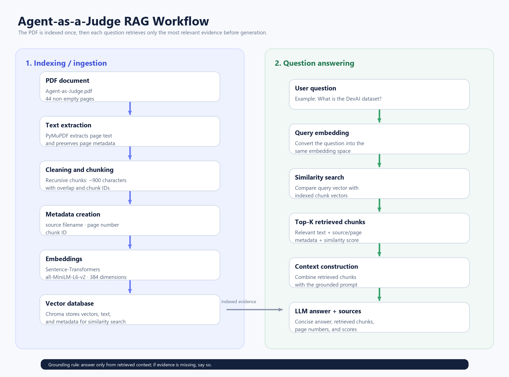

# Agent-as-a-Judge RAG Assistant

A retrieval-augmented generation chatbot for the research paper **Agent-as-a-Judge: Evaluate Agents with Agents** by Mingchen Zhuge et al. The application retrieves relevant passages from the PDF before asking an LLM to answer, and displays the retrieved chunks with source filenames, page numbers, and similarity scores.

## Problem statement

The goal is to answer questions about one research paper using evidence from the paper itself. The system must perform real semantic retrieval rather than sending the complete PDF to the language model.

## Architecture



The workflow is:

1. Extract text from every non-empty PDF page with PyMuPDF.
2. Split page text into overlapping chunks and preserve page metadata.
3. Generate 384-dimensional embeddings with `sentence-transformers/all-MiniLM-L6-v2`.
4. Store embeddings, text, and metadata in ChromaDB.
5. Embed the user question and retrieve the most relevant chunks.
6. Combine the retrieved context with a grounded prompt.
7. Generate a streamed answer through OpenRouter.
8. Display the answer and retrieved evidence in the Streamlit interface.

## Technologies

- Python 3.11+
- PyMuPDF for PDF extraction
- LangChain text splitters for chunking
- Sentence Transformers for embeddings
- ChromaDB for vector storage
- OpenRouter-compatible OpenAI client for the LLM
- Streamlit for the chatbot UI
- Pillow for generating the workflow diagram

## Project structure

```text
enverus assignment/
├── data/
│   └── Agent-as-Judge.pdf
├── src/
│   ├── ingestion.py
│   ├── chunking.py
│   ├── embeddings.py
│   ├── vector_store.py
│   ├── retriever.py
│   ├── rag_pipeline.py
│   └── app.py
├── visualization/
│   ├── rag_workflow.png
│   └── create_workflow.py
├── chroma_db/
├── tests/
├── requirements.txt
├── README.md
├── .gitignore
└── .env
```

## Installation on Windows

Open PowerShell in the project folder:

```powershell
python -m venv .venv
.\.venv\Scripts\Activate.ps1
python -m pip install -r requirements.txt
```

## Environment setup

Create a `.env` file in the project root. Never commit this file or expose the API key.

```env
OPENROUTER_API_KEY=your_openrouter_api_key
OPENROUTER_MODEL=nvidia/nemotron-3-ultra-550b-a55b:free
OPENROUTER_BASE_URL=https://openrouter.ai/api/v1
```

## Build the local index

Run these commands from the project root after activating the virtual environment:

```powershell
python .\src\ingestion.py
python .\src\chunking.py
python .\src\embeddings.py
python .\src\vector_store.py
```

The vector-store step creates the local `chroma_db/` directory. The embedding model is downloaded from Hugging Face the first time it is used.

## Run the chatbot

```powershell
streamlit run .\src\app.py
```

Open the local URL shown by Streamlit, normally `http://localhost:8501`.

The interface supports:

- Multiple conversations with chat history
- Light and dark mode
- Adjustable top-K retrieval
- Streaming assistant responses
- Retrieved chunk text
- Source filename and page number
- Similarity score for each retrieved chunk

## Deploy publicly with Streamlit Community Cloud

1. Create a GitHub repository and push this project. Do not push `.env`, `.venv`, or `chroma_db/`.
2. Open [Streamlit Community Cloud](https://share.streamlit.io/) and choose **New app**.
3. Select the GitHub repository, the default branch, and set the main file to `src/app.py`.
4. In the app settings, add these secrets:

```toml
OPENROUTER_API_KEY = "your_openrouter_api_key"
OPENROUTER_MODEL = "nvidia/nemotron-3-ultra-550b-a55b:free"
OPENROUTER_BASE_URL = "https://openrouter.ai/api/v1"
```

5. Deploy the app and wait for the first build. Because `chroma_db/` is intentionally not committed, the app creates the index from `data/Agent-as-Judge.pdf` on its first startup.

The first deployment can take longer because the embedding model must be downloaded and the PDF must be indexed. Later app restarts reuse the generated index during that deployment.

## Run the smoke tests

The project includes lightweight tests for PDF extraction, metadata preservation, chunking, and prompt construction. They do not call the paid LLM API.

```powershell
python -m unittest discover -s tests -v
```

## Example questions

- What is the DevAI dataset, and how many tasks, requirements, and preferences does it contain?
- What percentage of evaluation time and cost does Agent-as-a-Judge save compared to using three human experts?
- According to Section 4.4, how much did Agent-as-a-Judge cost and how long did it take?
- Which three open-source agentic frameworks were benchmarked on DevAI?

## Grounding behavior

The prompt instructs the model to answer only from the retrieved context, preserve numerical units, avoid unsupported facts, and say when the retrieved evidence is insufficient. The application exposes the retrieved chunks so answers can be checked against the PDF.

## Chunking and retrieval configuration

Chunks are approximately 900 characters with overlap. Each chunk stores its source filename, page number, and chunk ID. Retrieval combines semantic similarity with lexical and phrase matching to improve questions containing exact terms, names, section numbers, and numerical facts.

## Limitations

- The system currently indexes one PDF.
- Retrieval quality depends on chunking and embedding quality.
- PDF extraction may be imperfect for figures, tables, and unusual layouts.
- The free OpenRouter model may have rate limits or variable response latency.
- Similarity scores are retrieval signals, not truth probabilities.

## Future improvements

- Add automated retrieval and answer evaluation.
- Add reranking or MMR retrieval for more diverse evidence.
- Improve table and figure extraction.
- Add persistent configuration and document upload support.
- Add citation-aware answer formatting and evaluation traces.

## Security

API keys belong only in `.env`. The `.gitignore` file excludes secrets, caches, local databases, and generated Python files from Git.
